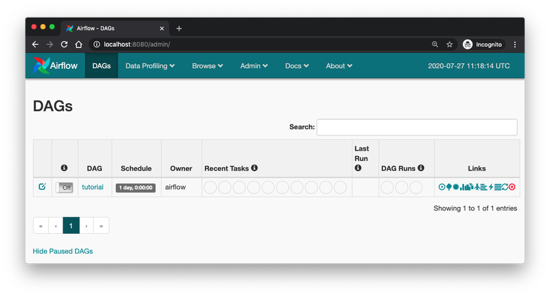
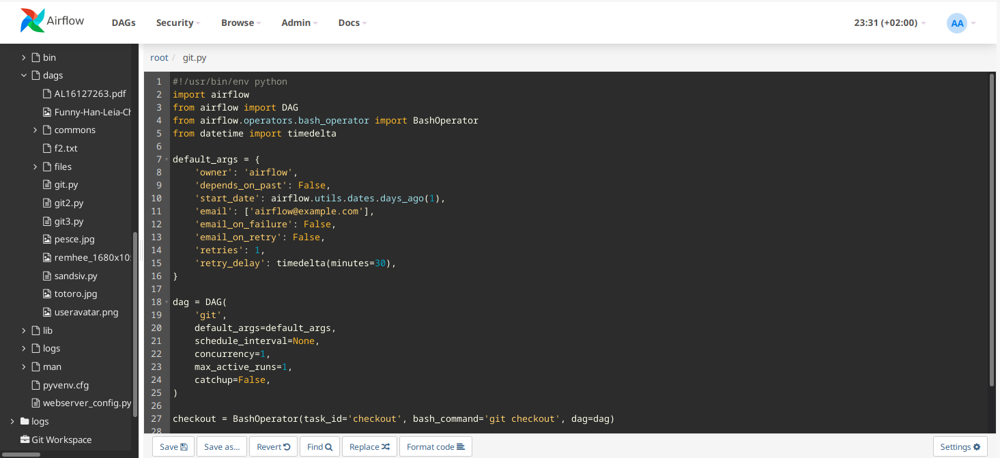
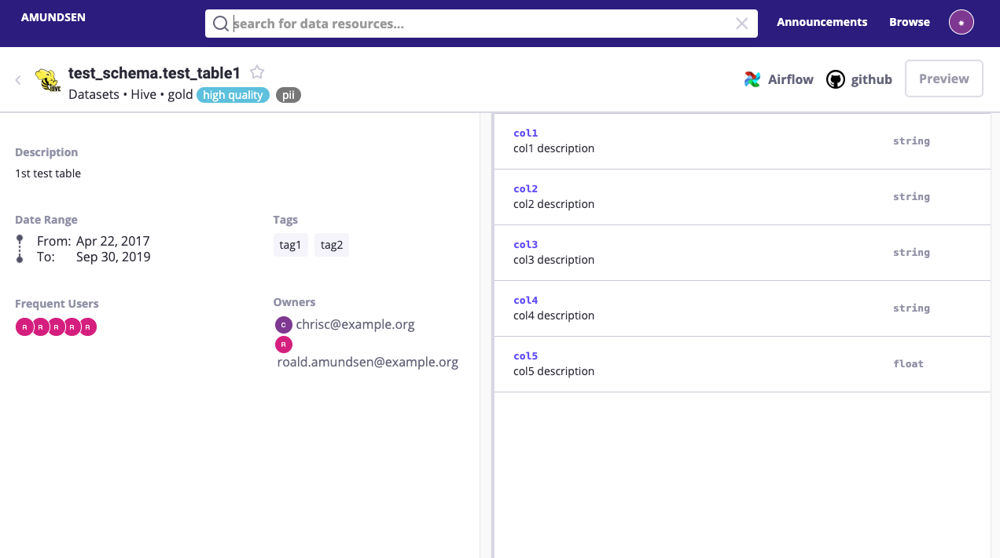

# data-integration

# About this Project
Example of a Data Integration project

## Built With
* Python 3.9.7
* Docker
* Airflow 2.0+
* Postgres
* Amundsen

## Components
* Warehouse: stores analytics data (fact / dimensions)
* Orchestrator: executes pipelines
* Governance: metadata management and data governance (lineage, documentation)

## Usage

```
git clone <repo>
cd <repo>
docker-compose up --build
```

### Airflow Web UI
Airflow UI which provides an admin interface for monitoring jobs, retrying tasks, managing secrets / user permissions.


### Airflow Code Editor Plugin
Plugin which lets you edit files (via. airflow web ui). Credits to andreax79.


### Amundsen UI
Centralized data catalog, lineage and governance tool which seamlessly integrates with airflow. Credits to amundsen-io.
